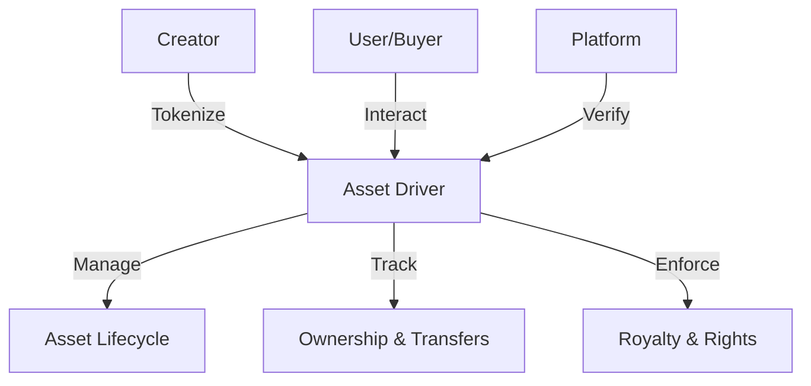

# CeFi Driver: Decentralized Asset Management Protocol

A comprehensive blockchain-based framework for tokenizing, managing, and trading digital assets with advanced provenance tracking and ownership verification.

## Overview

CeFi Driver provides a robust, secure infrastructure for digital asset management, enabling creators, platforms, and users to:

- Tokenize digital assets with rich metadata
- Establish verifiable ownership and transfer rights
- Create programmable asset marketplaces
- Enable cross-platform asset interoperability

## Key Features

- 🔒 Secure asset registration and ownership tracking
- 💱 Flexible marketplace mechanics
- 🔍 Comprehensive metadata management
- 💸 Automated royalty distribution
- 🌐 Platform-agnostic design

## Architecture



## Getting Started

### Prerequisites
- Clarinet
- Stacks wallet
- STX tokens

### Quick Example

Register a digital asset:
```clarity
(contract-call? .asset-driver register-asset
    "https://asset-metadata.url"
    "Awesome Digital Asset"
    "Unique collectible item"
    {x: u100, y: u100, z: u100}
    (list "Platform1" "Platform2")
    "PG"
    "GLB"
    true
    u50)
```

## Core Functions

### Asset Management
- `register-asset`: Create new asset registration
- `transfer-asset`: Transfer ownership
- `update-asset-metadata`: Modify asset details
- `update-asset-settings`: Adjust transferability

### Marketplace
- `list-asset-for-sale`: Create sale listing
- `cancel-asset-listing`: Remove listing
- `verify-ownership`: Validate current ownership

## Security Considerations

- Limited transfer history tracking
- Configurable royalty percentages
- Strict metadata validation
- Ownership verification mechanisms

## Development

### Testing
```bash
clarinet test
```

### Local Development
```bash
clarinet console
```

## Contribution

Interested in contributing? Check our guidelines and join the decentralized asset revolution!

## License

[Insert Appropriate License]